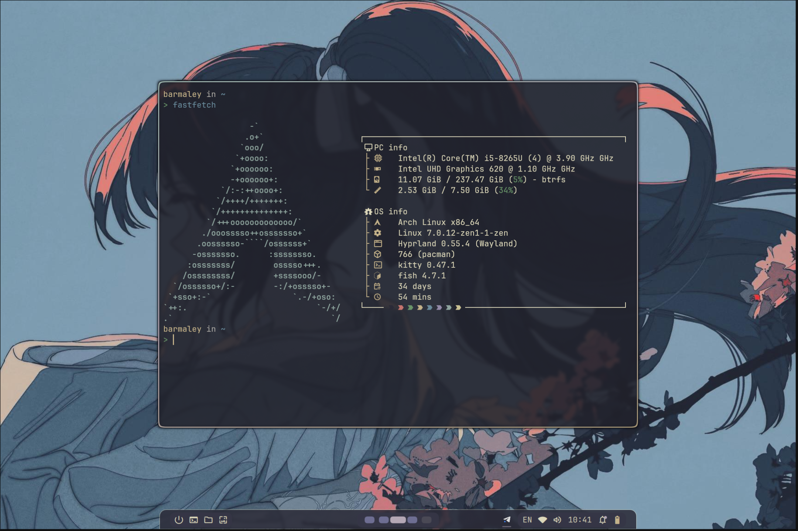
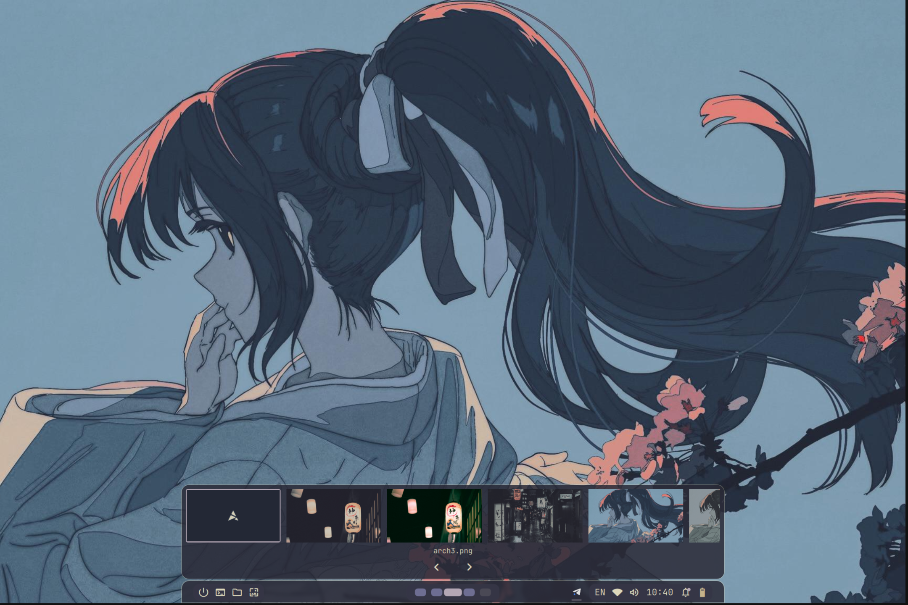
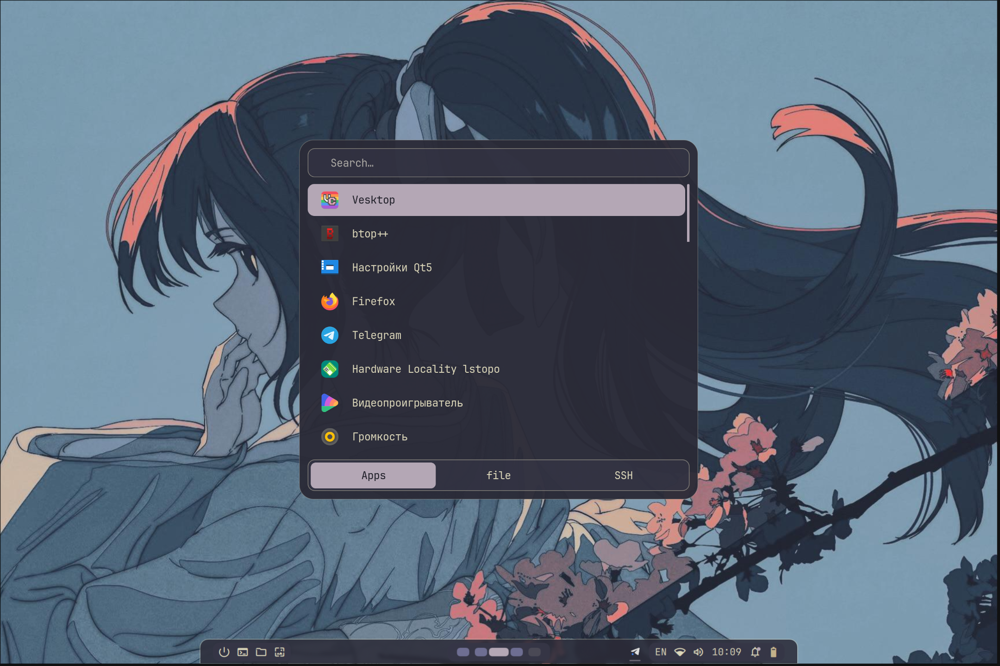
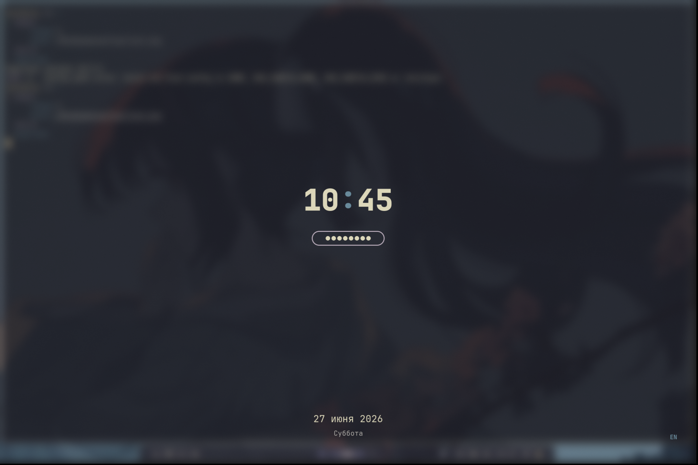
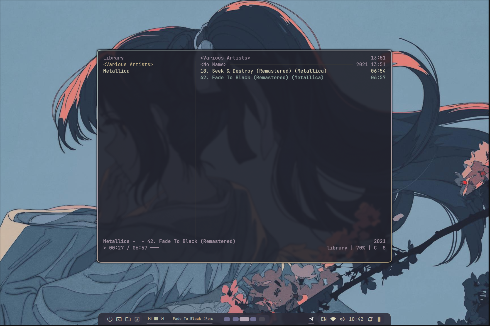

# Arch Linux + Hyprland

> Готовая к работе система на Arch Linux с оконным менеджером Hyprland, темой `kanagawa-paper` и полным набором настроенных приложений.

 [](README.en.md)

  

<!-- SYSTEM PARAMETERS -->
<h2 align="left">💻 System parameters</h2>

<table>
<tr>
<td valign="top" width="55%">

- **OS:** [**`Arch Linux`**](https://archlinux.org/)
- **WM:** [**`Hyprland`**](https://hyprland.org/) (Wayland, 0.55+ на Lua)
- **Bar / Popups / Notifications:** [**`Quickshell`**](https://quickshell.org/)
- **Terminal:** [**`kitty`**](https://sw.kovidgoyal.net/kitty/)
- **App Launcher:** [**`rofi`**](https://github.com/davatorium/rofi)
- **Lock / Idle:** [**`hyprlock`**](https://github.com/hyprwm/hyprlock) + [**`hypridle`**](https://github.com/hyprwm/hypridle)
- **Wallpaper:** [**`awww`**](https://github.com/LGFae/awww)
- **Shell:** [**`fish`**](https://fishshell.com/)
- **Theme:** `kanagawa-paper`

</td>
<td valign="top" width="45%">



</td>
</tr>
</table>

<!-- GALLERY -->
<a name="Gallery"></a>
<h2 align="center">🖼️ Gallery</h2>

<table>
<tr>
<td align="center" width="33%">
  <br>
  <b>Popups</b>
</td>
<td align="center" width="33%">
  <br>
  <b>Rofi</b>
</td>
</tr>
<tr>
<td align="center" width="33%">
  <br>
  <b>Lock-screen</b>
</td>
<td align="center" width="33%">
  <br>
  <b>cmus</b>
</td>
</tr>
</table>

<!-- TABLE OF CONTENTS -->
<a name="Table-of-Contents"></a>

# 📚 Table of Contents

+ [Установка](#Installation)
  + [Установка Arch Linux](#Install-Arch-Linux)
  + [SSH-ключ для GitHub](#SSH-Key-for-GitHub)
  + [Развёртывание сборки](#Install-Hyprland-Config)
+ [О системе](#About-System)
  + [Архитектура](#Architecture)
  + [Возможности](#Features)
  + [HotKeys](#HotKeys)
  + [Установленные пакеты](#Packages)
+ [Дополнительно](#Additional)
  + [Монтирование дополнительного диска](#Mount-Disk)

---

<!-- ===================== INSTALLATION ===================== -->
<a name="Installation"></a>
<h2 align="center">⚡ Установка</h2>

<a name="Install-Arch-Linux"></a>
### 1. Установка Arch Linux

Подробная инструкция — [`docs/Arch_linux_install.md`](docs/Arch_linux_install.md).

**Краткий порядок:**

- Разметка диска (GPT): EFI (1G) + swap (≈ RAM) + btrfs
- Создание subvolumes `@` и `@home` на btrfs
- Установка базовой системы: `base base-devel linux-zen ...`
- Настройка локалей, времени, сети
- Установка загрузчика systemd-boot
- Создание пользователя с правами `wheel`

> 💡 **Важно:** на десктопе с NVIDIA требуется добавить `nvidia-drm.modeset=1` в параметры ядра.

<a name="SSH-Key-for-GitHub"></a>
### 2. Настройка SSH-ключа для GitHub

Инструкция — [`docs/Setting_SSH_key.md`](docs/Setting_SSH_key.md).

**Сжато:**

```bash
ssh-keygen -t ed25519 -C "ваш_комментарий"
cat ~/.ssh/id_ed25519.pub   # скопировать вывод
```

→ Добавить ключ в [GitHub Settings → SSH keys](https://github.com/settings/keys).

Проверить:

```bash
ssh -T git@github.com
```

Настроить git (использовать **приватный no-reply email**):

```bash
git config --global user.name "Ваше Имя"
git config --global user.email "12345678+github@users.noreply.github.com"
```

<a name="Install-Hyprland-Config"></a>
### 3. Развёртывание сборки

```bash
# Клонировать репозиторий (целиком в ~/.config/hypr — включая точку входа hyprland.lua)
git clone https://github.com/MrTrigraf/ArchLinux-Hyprland.git ~/.config/hypr

# Запустить bootstrap (от обычного пользователя, НЕ через sudo)
cd ~/.config/hypr
./bootstrap.sh
```

> Если у тебя настроен SSH-ключ для GitHub — можно использовать `git@github.com:MrTrigraf/ArchLinux-Hyprland.git` вместо HTTPS-URL.

После завершения `bootstrap.sh` — выйти из tty (`exit`) и заново залогиниться. Fish автоматически запустит Hyprland через `exec start-hyprland`.

[⬆ Back to the Top](#Table-of-Contents)

---

<!-- ===================== ABOUT SYSTEM ===================== -->
<a name="About-System"></a>
<h2 align="center">⚙️ О системе</h2>

<a name="Architecture"></a>
<h3 align="center">🏗️ Архитектура</h3>

- `hyprland.lua` — точка входа Hyprland (короткий `dofile` на активную тему)
- `bootstrap.sh` — установка пакетов и создание симлинков
- `kanagawa-paper/hypr/` — Lua-модули Hyprland (input, keybinds, windowrules, animations)
- `kanagawa-paper/quickshell/` — статус-панель, попапы, уведомления (QML, Qt 6)
- `kanagawa-paper/hypridle/`, `kanagawa-paper/hyprlock/` — sleep и lock (hyprlang)
- `kanagawa-paper/rofi/` — лаунчер (`drun` + `files` + `ssh`)
- `kanagawa-paper/kitty/`, `kanagawa-paper/fish/`, `kanagawa-paper/starship/`, `kanagawa-paper/cmus/` — конфиги приложений
- `kanagawa-paper/theming/` — GTK / Qt / cursor / dconf
- `kanagawa-paper/wallpaper/` — обои

[⬆ Back to the Top](#Table-of-Contents)

<a name="Features"></a>
<h3 align="center">🚀 Возможности</h3>

- Hyprland 0.55+ на новом Lua API (не на устаревшем hyprlang).
- Статус-панель, попапы и уведомления — собственная реализация на Quickshell, без Waybar / mako / nm-applet / blueman-applet.
- Один репозиторий на две машины: laptop vs desktop split в `bootstrap.sh`.
- Модульный конфиг — смена темы через правку одной строки в точке входа.
- Тема `kanagawa-paper` — приглушённая палитра без неона.

[⬆ Back to the Top](#Table-of-Contents)

<a name="HotKeys"></a>
<h3 align="center">⌨️ HotKeys</h3>

- **Терминал (kitty)** — `super + enter`
- **kitty с nvim** — `super + n`
- **Файловый менеджер (nautilus)** — `super + e`
- **Браузер (firefox)** — `super + b`
- **Лаунчер приложений (rofi)** — `super + r`
- **Закрыть окно** — `super + q`
- **Toggle float** — `super + v`
- **togglesplit (dwindle)** — `super + shift + j`
- **Lock-screen (hyprlock)** — `super + shift + l`
- **cmus в плавающем kitty** — `super + shift + p`
- **Exit Hyprland** — `super + shift + r`
- **Reload Quickshell** — `super + ctrl + r`
- **Фокус окна (vim-style)** — `super + h / j / k / l`
- **Переключить workspace** — `super + 1..5`
- **Переместить окно на workspace** — `super + shift + 1..5`
- **Скролл по workspaces** — `super + wheel`
- **Special workspace `magic`** — `super + s` / `super + shift + s`
- **Drag / resize окна** — `super + lmb / rmb`
- **Скриншот → буфер** — `print`
- **Скриншот → файл** — `shift + print`

Полный список — в `~/.config/hypr/kanagawa-paper/hypr/keybindings.lua`.

[⬆ Back to the Top](#Table-of-Contents)

<a name="Packages"></a>
<h3 align="center">📦 Установленные пакеты</h3>

<details>
<summary><b>📦 Pacman — общие (~58 шт)</b></summary>

**Hyprland core + инфраструктура:**
`hyprland` · `hyprlock` · `hyprshot` · `hypridle` · `hyprpolkitagent` · `xdg-desktop-portal-hyprland` · `xdg-desktop-portal-gtk` · `xorg-xwayland` · `qt5-wayland` · `qt6-wayland` · `qt5ct` · `qt6ct` · `lua` · `quickshell` · `awww`

**Шрифты:** `noto-fonts` · `noto-fonts-emoji` · `ttf-jetbrains-mono-nerd`

**Аудио:** `pipewire` · `pipewire-pulse` · `pipewire-jack` · `wireplumber` · `pavucontrol` · `playerctl`

**GStreamer codecs:** `gst-plugins-base` · `gst-plugins-good` · `gst-plugins-bad` · `gst-plugins-ugly` · `gst-libav` · `gst-plugin-pipewire`

**Shell и промпт:** `fish` · `starship` · `lsd`

**CLI-утилиты:** `git` · `less` · `fastfetch` · `btop` · `wl-clipboard`

**Лаунчер:** `rofi`

**GUI-приложения:** `firefox` · `telegram-desktop` · `obsidian` · `nautilus` · `sushi` · `file-roller` · `viewnior` · `showtime` · `cmus` · `impression`

**Темизация:** `papirus-icon-theme` · `adw-gtk-theme`

**Network:** `nm-connection-editor` · `networkmanager-openvpn`

**Notifications:** `sound-theme-freedesktop` · `libnotify`

**Автомонтирование:** `udiskie`

**База:** `kitty` · `polkit`

</details>

<details>
<summary><b>💻 Laptop-only — условно через <code>is_laptop</code> (5 шт)</b></summary>

- `power-profiles-daemon` — режимы энергопотребления
- `brightnessctl` — управление яркостью
- `bluez` · `bluez-utils` · `blueman` — Bluetooth-стек

</details>

<details>
<summary><b>🌐 AUR — через <code>yay-bin</code> (4 шт)</b></summary>

- `vesktop-bin` — Discord-клиент на Electron с патчами
- `ttf-material-symbols-variable-git` — Material Symbols (variable FILL/weight)
- `xcursor-pro-hyprcursor` — курсорная тема под hyprcursor
- `papirus-folders-git` — цветные папки для Papirus-Dark

</details>

[⬆ Back to the Top](#Table-of-Contents)

---

<!-- ===================== ADDITIONAL ===================== -->
<a name="Additional"></a>
<h2 align="center">🧩 Дополнительно</h2>

<a name="Mount-Disk"></a>
### 💽 Монтирование дополнительного диска

Подключение отдельного SSD (например, под игры) с автомонтированием через
`/etc/fstab`, строго по UUID. Инструкция включает выбор между `ext4` и `btrfs`
и проверку конфигурации до перезагрузки.

Полная инструкция — [`docs/Mount_disk.md`](docs/Mount_disk.md).

[⬆ Back to the Top](#Table-of-Contents)
